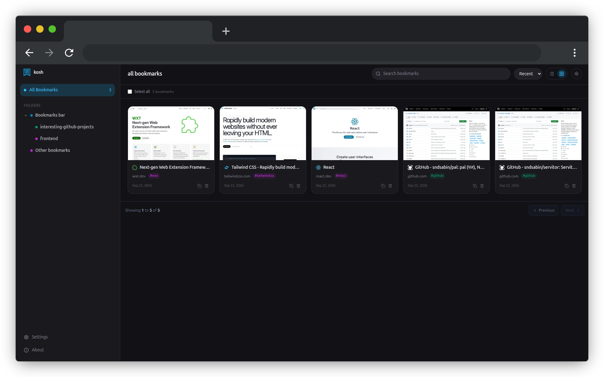

<p align="center">
  
</p>

# kosh

**kosh (कोष)**, Nepali for “collection” or “repository”, is a browser bookmark manager that helps you save, organize, tag, and quickly find your favorite web pages. It works with your browser’s native bookmarks, offering a focused interface for organizing large collections without migrating to a separate service.



## Tech Stack

kosh is built with:

- [WXT](https://wxt.dev/)
- [React](https://react.dev/)
- [TypeScript](https://www.typescriptlang.org/)
- [Tailwind CSS](https://tailwindcss.com/)
- [Zustand](https://zustand.docs.pmnd.rs/)
- [Vite](https://vite.dev/)
- [Prettier](https://prettier.io/)

## Browser Permissions

kosh currently requests the following browser permissions:

| Permission  | Purpose                                       |
| ----------- | --------------------------------------------- |
| `bookmarks` | Read and modify browser bookmarks and folders |
| `storage`   | Store extension specific settings/state       |
| `downloads` | Export bookmarks as an HTML file              |

## Getting Started

### Prerequisites

- [Node.js](https://nodejs.org/)
- npm

### Clone the repository

```bash
git clone https://github.com/sndsabin/kosh && cd kosh
```

### Start development

```bash
make dev
```

### Development with Firefox

```bash
make dev-firefox
```

## Building

Build the extension for the default browser target:

```bash
make build
```

Build for Firefox:

```bash
make build-firefox
```

Create a distributable extension archive:

```bash
make zip
```

Create a Firefox archive:

```bash
make zip-firefox
```

The generated extension files are placed in WXT's output directory.

## Contributing

Contributions, feature requests, and bug reports are welcome. Feel free to open an issue or submit a pull request.

## License

See the `LICENSE` file in the repository for licensing information.
